```text
  ███╗   ███╗ ██████╗ ███╗   ██╗███████╗██╗   ██╗
  ████╗ ████║██╔═══██╗████╗  ██║██╔════╝╚██╗ ██╔╝
  ██╔████╔██║██║   ██║██╔██╗ ██║█████╗   ╚████╔╝ 
  ██║╚██╔╝██║██║   ██║██║╚██╗██║██╔══╝    ╚██╔╝  
  ██║ ╚═╝ ██║╚██████╔╝██║ ╚████║███████╗   ██║   
  ╚═╝     ╚═╝ ╚═════╝ ╚═╝  ╚═══╝╚══════╝   ╚═╝   
  ████████╗██████╗  █████╗  ██████╗██╗  ██╗███████╗██████╗ 
  ╚══██╔══╝██╔══██╗██╔══██╗██╔════╝██║ ██╔╝██╔════╝██╔══██╗
     ██║   ██████╔╝███████║██║     █████╔╝ █████╗  ██████╔╝
     ██║   ██╔══██╗██╔══██║██║     ██╔═██╗ ██╔══╝  ██╔══██╗
     ██║   ██║  ██║██║  ██║╚██████╗██║  ██╗███████╗██║  ██║
     ╚═╝   ╚═╝  ╚═╝╚═╝  ╚═╝ ╚═════╝╚═╝  ╚═╝╚══════╝╚═╝  ╚═╝
```

# 💰 Money Tracker - Income Timeline Manager

### *A Smart, Secure, and Elegant Income Tracking Solution built with Flutter*

> **A beautifully designed mobile application to forecast, track, and manage your upcoming and received income.**
> Featuring recurring projections, local database management, robust security via PIN, and a dynamic dashboard for complete financial visibility!

[](https://github.com/naimurhamim)
[](#)
[](#)
[](#)
[](#)

<br/>

[](https://github.com/naimurhamim/income-timeline-tracker-app/releases/latest)

---

## 📌 Project Overview

Money Tracker is a feature-rich financial application focused exclusively on tracking **Income**. It allows users to manage fixed deposits, savings, DPS, bonds, and other recurring or one-time income sources. 

The system provides a clear timeline of upcoming receivables, automatically projecting future dates for recurring entries (Monthly, Quarterly, Half-Yearly, Yearly) up to a defined expiry date. With local persistence, no data ever leaves the user's device, ensuring maximum privacy and security.

**Core Objectives:**
- Provide a clear, timeline-based forecast of expected income (Next 3 months, Yearly, etc.).
- Ensure a premium, butter-smooth UI/UX using `flutter_animate` and glassmorphism design principles.
- Deliver cross-platform support (Android).
- Keep data 100% offline and secure with local SQLite and PIN lock authentication.

---

## 🎬 App Walkthrough & Screenshots

### 🔐 Step 1 — Secure Your Data with PIN Lock

When opening the app for the first time, you can set up a **4-digit PIN lock** from Settings. Once enabled, every time you launch the app, you'll be greeted with a beautiful lock screen. The app also supports **fingerprint authentication** for quick access.

| PIN Lock Screen | Security Settings |
|---|---|
| 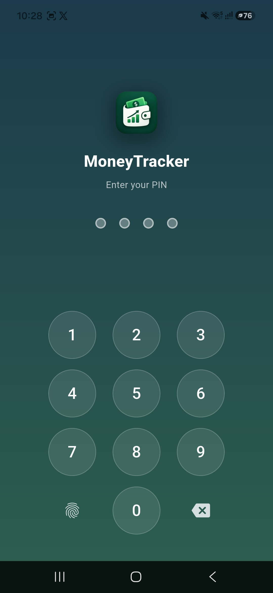 | 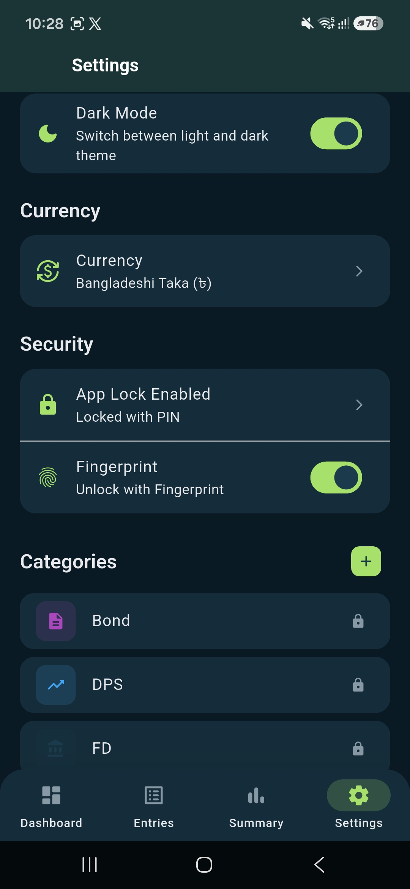 |

---

### 🏠 Step 2 — Your Dashboard at a Glance

The **Dashboard** is your home screen. It shows you everything you need at a glance — how much income is expected **this month**, how much you've already **received**, and your **next upcoming** entry with a countdown timer. The dashboard supports both **Light** and **Dark** themes for comfortable viewing.

| Dashboard (Light Mode) | Dashboard (Dark Mode) |
|---|---|
| 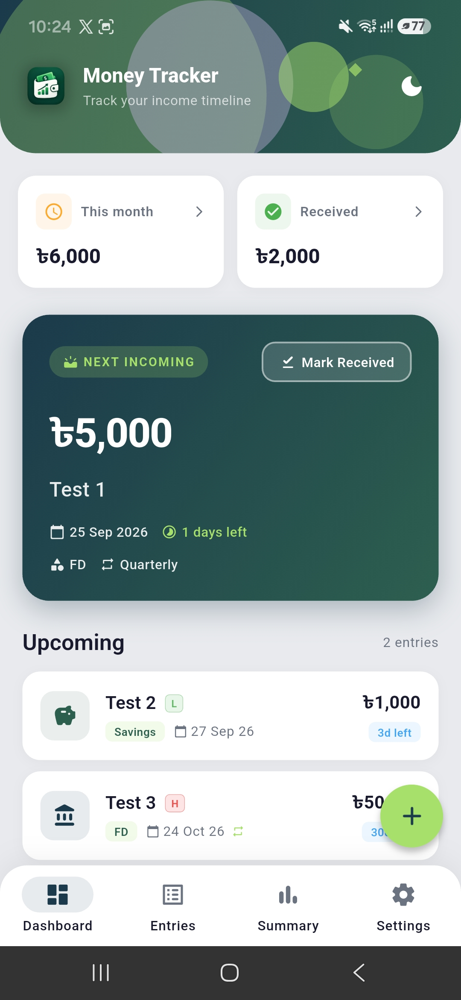 | 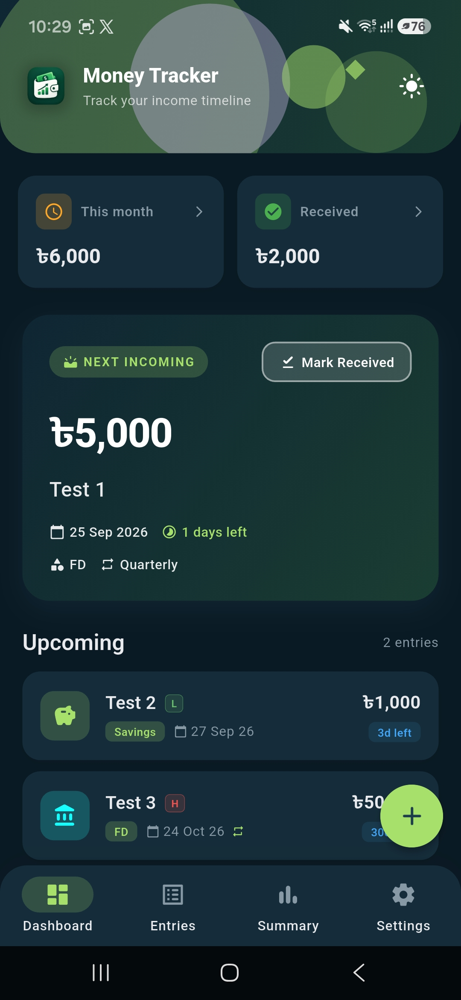 |

---

### ➕ Step 3 — Add a New Income Entry

Tap the **"+"** floating button to add a new income entry. Fill in the **title**, **amount**, **expected date**, and select a **category** (FD, DPS, Savings, Bond, Insurance). You can set the **priority** level and enable **recurring** mode — choose from Monthly, Quarterly, Half Yearly, or Yearly. Optionally, set an **expiry date** to stop recurring after a certain date.

| Add Entry — Top Section | Add Entry — Bottom Section |
|---|---|
| 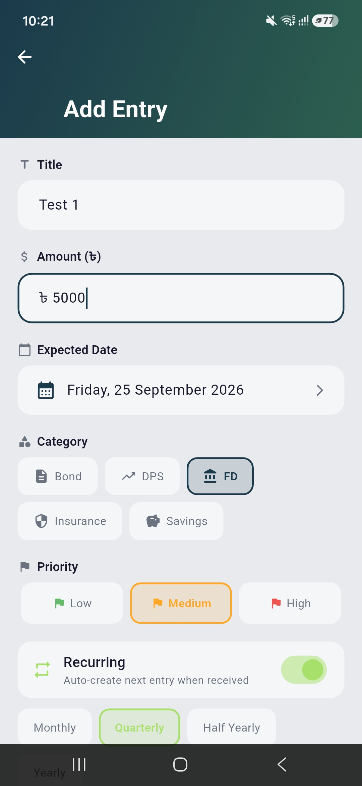 | 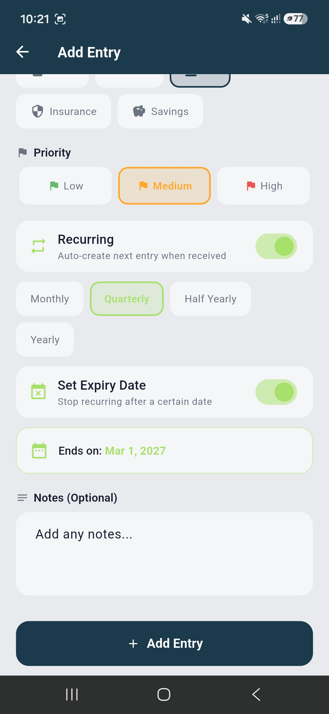 |

---

### 📋 Step 4 — Browse All Entries

The **Entries** screen shows all your income entries organized in two tabs: **Upcoming** (pending income) and **Received** (income you've already collected). At the top, you'll see quick stats including **Est. Yearly Amount**, **Est. Next 3 Months**, and **Est. Monthly Avg**. A **total badge** at the top of the list shows the combined count and amount.

| Upcoming Entries | Received Entries |
|---|---|
| 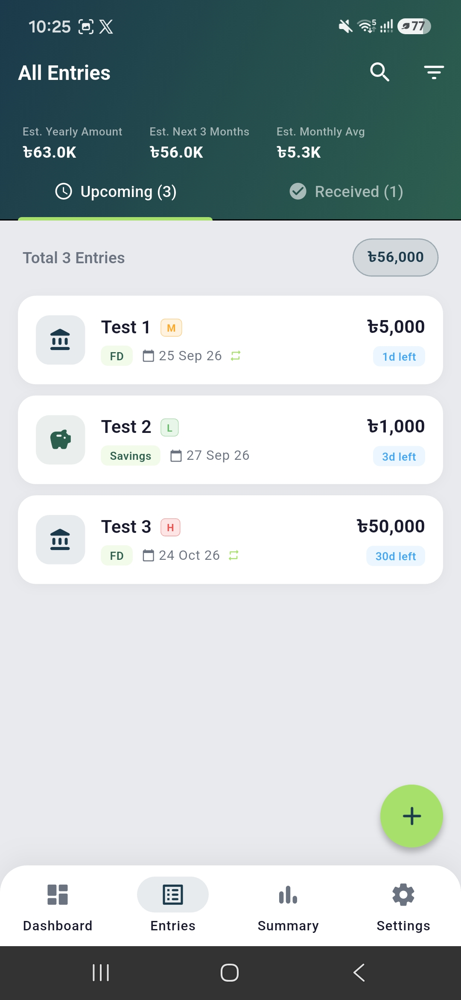 | 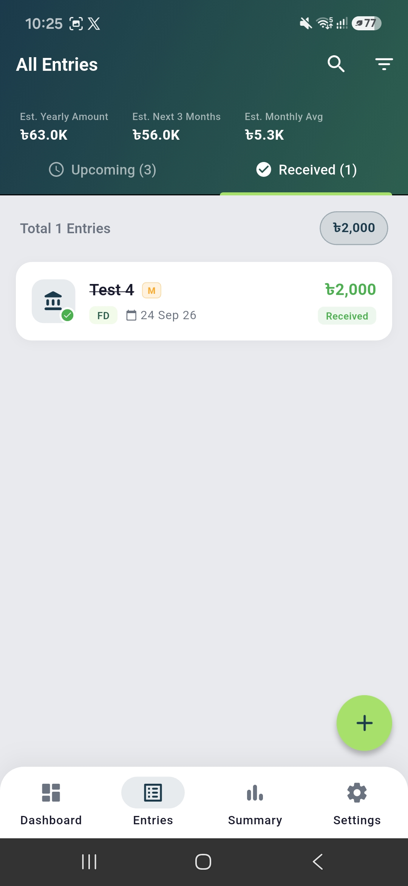 |

> 💡 **Tip:** Swipe right on any entry to quickly **Mark as Received**. Swipe left to **Edit** or **Delete** it!

---

### 📊 Step 5 — Analyze Your Income

The **Summary** screen gives you a yearly overview of your finances. It breaks down your income **by category** with visual progress bars showing each category's percentage. Below that, the **Monthly Breakdown** shows exactly how much income is expected in each month — split between upcoming and already received amounts.

| Summary & Analytics |
|---|
| 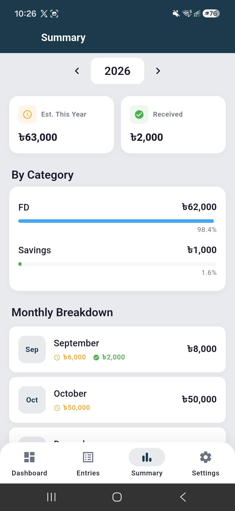 |

---

### ⚙️ Step 6 — Customize Your Settings

The **Settings** screen lets you personalize the app to your liking. Toggle **Dark Mode**, change the **Currency** (BDT, USD, EUR, etc.), manage **App Lock** & **Fingerprint**, and add or manage **Categories**. The About section shows the app version and privacy information — all data stays on your device.

| Settings (Top) | Settings (Bottom) |
|---|---|
| 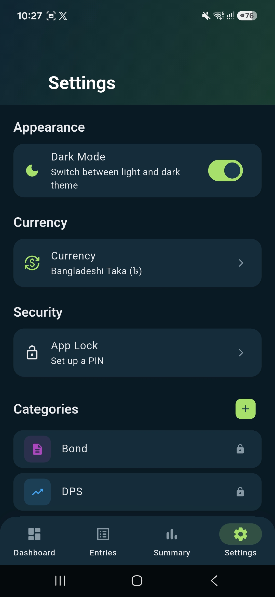 | 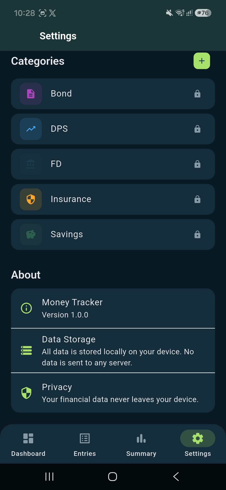 |

---

## ✨ Features

| Feature | Description |
|---|---|
| 🔄 **Smart Recurring Projections** | Automatically calculates future dates and totals for recurring income until a set expiry date. |
| 📊 **Dynamic Analytics** | Provides estimated yearly totals, next 3 months projections, and categorical breakdowns. |
| 🔒 **PIN Lock Security** | Secures financial data with a custom in-app PIN lock system with fingerprint support. |
| 🔔 **Local Notifications** | Sends automated background reminders (7 days before, 3 days before, and on the exact day) for upcoming income. |
| 🎨 **Premium UI & Dark Mode** | Built with an aesthetically pleasing gradient-rich design, smooth bouncy tap interactions, and seamless dark mode support. |
| 💱 **Multi-Currency Support** | Switch between BDT, USD, EUR, and more globally used currencies seamlessly. |

---

## 🛠️ Tech Stack

| Component | Technology |
|---|---|
| **Framework** | Flutter |
| **Language** | Dart |
| **State Management** | Provider |
| **Local Database** | SQLite (`sqflite`) |
| **Animations** | `flutter_animate`, Custom Route Transitions |
| **Local Notifications** | `flutter_local_notifications` |

---

## 🚀 Getting Started

### 1. Prerequisites
- Flutter SDK (stable channel)
- Dart SDK
- Android Studio / VS Code

### 2. Installation
```powershell
# Clone the repository
git clone https://github.com/naimurhamim/income-timeline-tracker-app.git
cd income-timeline-tracker-app

# Get dependencies
flutter pub get

# Run the app
flutter run
```

### 3. Building for Production
```powershell
# Build Android APK
flutter build apk --release
```

---

## 📁 Repository Structure
```text
MoneyTracker/
│
├── android/                # Android native project files
├── assets/                 # Images, Fonts, Icons, Screenshots
├── lib/                    # Source Code
│   ├── database/           # SQLite database helpers and migrations
│   ├── models/             # Data classes (Entry, Category)
│   ├── providers/          # State management (EntryProvider, ThemeProvider, etc.)
│   ├── screens/            # UI Screens (Dashboard, Entries, Summary, Settings)
│   ├── services/           # Background services (Notifications, Auth)
│   ├── theme/              # Colors, TextStyles, Dark/Light mode definitions
│   └── widgets/            # Reusable UI components (Cards, Tiles, Animations)
│
├── pubspec.yaml            # Flutter dependencies and assets configuration
└── README.md               # Project documentation
```

---

## 👨‍💻 Author

**MD Naimur Rashid (Hamim)**
- 🌐 **Website:** [naimurrashid.dev](https://naimurrashid.dev/)
- 💼 **LinkedIn:** [md-naimur-rashid](https://www.linkedin.com/in/md-naimur-rashid/)
- 🐙 **GitHub:** [@naimurhamim](https://github.com/naimurhamim)

---
*Built as a showcase for Advanced Mobile App Development, combining clean architecture, premium UI/UX, and robust local data management.*
